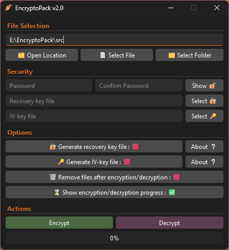
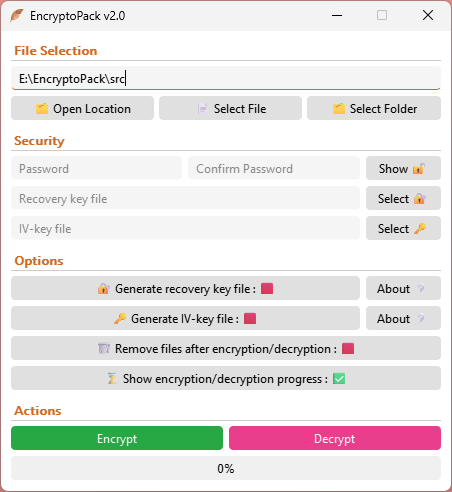

<div align="center"></div>

# EncryptoPack - AES-256 Encryption for Files and Folders

EncryptoPack is a lightweight app built to keep your sensitive data safe with industry-grade encryption. Whether you're locking down personal documents or securing work files, it makes encrypting and decrypting files and folders quick and painless.

## 🔒 Why Encryption Matters

Encryption turns readable data into a scrambled mess that only authorized users can make sense of. It's one of your best defenses against:

- Unauthorized access
- Data tampering
- Theft or leaks

## ⚙️ What EncryptoPack Offers

- File and folder encryption using AES-256
- A simple interface - no technical expertise needed
- Fast performance, even on large folders
- A recovery key so a forgotten password doesn't lock you out for good
- Support for a separate ivkey file if you want an extra layer of security

Take control of your digital privacy with EncryptoPack - where security meets simplicity.

---

## 🖼️ Screenshots

<div align="center">

<table>
  <tr>
    <td>
      
    </td>
    <td>
      
    </td>
  </tr>
</table>

</div>

> Tip: You can also just drag your files straight into the app — no need to browse for them.

---

## 🚀 Get Started with EncryptoPack

#### For Most Users — Download the Ready-to-Use App

No setup needed. Just grab the latest Windows binary from the [Releases Page](https://github.com/8gudbits/EncryptoPack/releases).

<a href="https://github.com/8gudbits/EncryptoPack/releases/tag/v2.1">  </a>

#### 🛠️ For Developers - Run from Source

Prefer running it from source, or on Linux/macOS? Here's how:

1. Clone the repository:

```
git clone --depth 1 https://github.com/8gudbits/EncryptoPack.git
cd EncryptoPack/src
```

2. Install the dependencies:

- On Windows:
  ```
  pip install -r requirements.txt
  ```
- On Linux/macOS:
  ```
  pip3 install -r requirements.txt
  ```

That's it — you're ready to run EncryptoPack locally and start encrypting your files.

> Note: Got a file encrypted with an older format? EncryptoPack will let you know which version you need to decrypt it — no surprises, no broken files.

---

## Documentation

Specification files live in [/specs](/specs):
- [Format Specification](/specs/format_spec.md)
- [Diagrams](/specs/diagrams)

---

