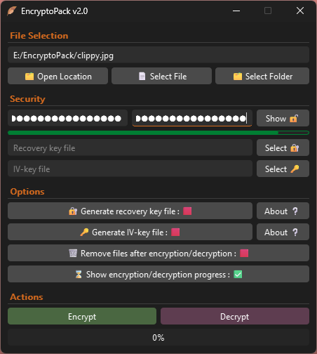
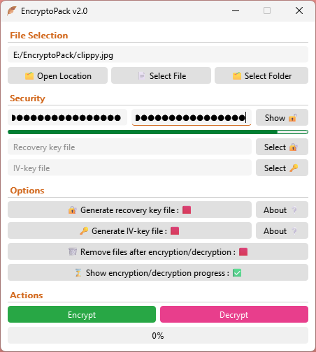

<div align="center"></div>

# EncryptoPack - AES-256 Encryption for Files and Folders

EncryptoPack is a lightweight application designed to safeguard sensitive data with industry-grade encryption. Whether protecting personal documents or securing work files, EncryptoPack makes it easy to encrypt and decrypt files and folders with confidence.

## 🔒 Why Encryption Matters

Encryption transforms readable data into a scrambled format that can only be accessed by authorized users. It's a critical layer of defense against:

- Unauthorized access
- Data tampering
- Theft or leaks

## ⚙️ What EncryptoPack Offers

- Encryption of files and folders using AES-256 encryption.
- Simple Interface - No technical expertise required
- Fast Performance - Encrypt large folders quickly
- Generate a recovery key to recover forgotten password
- Supports a separate ivkey file for extra security

Take control of your digital privacy with EncryptoPack - where security meets simplicity.

---

## 🖼️ Screenshots

<div align="center">

<table>
  <tr>
    <td>
      
    </td>
    <td>
      
    </td>
  </tr>
</table>

</div>

> Tip: You can also drag your files directly into the app - no browsing needed!

---

## 🚀 Get Started with EncryptoPack

#### 🧑‍💻 For Most Users - Download the Ready-to-Use App

No setup required! Just download the latest Windows binary from the [Releases Page](https://github.com/8gudbits/EncryptoPack/releases).

<a href="https://github.com/8gudbits/EncryptoPack/releases/tag/v2.1">  </a>

#### 🛠️ For Developers - Run from Source

If you prefer to run EncryptoPack from source or you're on Linux/macOS, follow these steps:

1. Clone the repository using git:

```
git clone --depth 1 https://github.com/8gudbits/EncryptoPack.git
cd EncryptoPack/src
```

2. Install dependencies:

- On Windows:
  ```
  pip install -r requirements.txt
  ```
- On Linux/macOS:
  ```
  pip3 install -r requirements.txt
  ```

Once installed, you're ready to run EncryptoPack locally and start encrypting your files securely.

> Note: Encrypted with an older format? You'll be informed about the compatible version for decryption - no surprises, no broken files.

---

## Documentation

Specification files are in [/specs](/specs):
- [Format Specification](/specs/format_spec.md)
- [Diagrams](/specs/diagrams)

---

